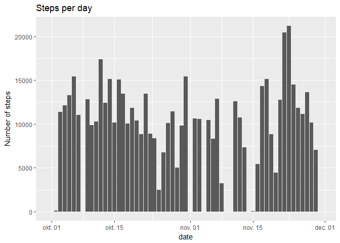
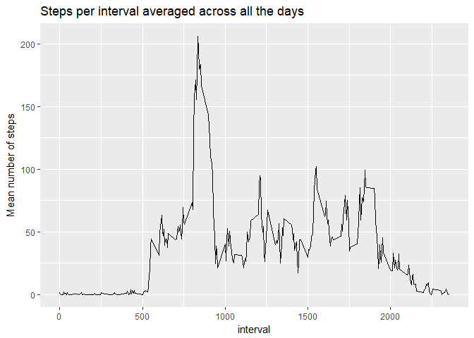
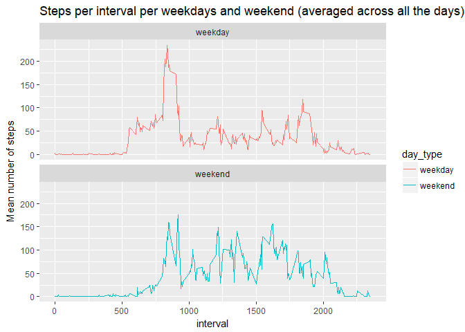

# Reproducible Research: Peer Assessment 1


## Loading and preprocessing the data

### Loading packages and file

```r
library(dplyr)
library(ggplot2)

file <- unzip('./activity.zip')
activity <- read.csv(file)
```
### Variable transformations for later use


```r
activity$date <- as.Date(activity$date, "%Y-%m-%d")
activity$weekday <- weekdays(activity$date)
```

### Structure and summary of activity

```r
str(activity)
```

```
## 'data.frame':	17568 obs. of  4 variables:
##  $ steps   : int  NA NA NA NA NA NA NA NA NA NA ...
##  $ date    : Date, format: "2012-10-01" "2012-10-01" ...
##  $ interval: int  0 5 10 15 20 25 30 35 40 45 ...
##  $ weekday : chr  "ponedeljak" "ponedeljak" "ponedeljak" "ponedeljak" ...
```

```r
summary(activity)
```

```
##      steps             date               interval        weekday         
##  Min.   :  0.00   Min.   :2012-10-01   Min.   :   0.0   Length:17568      
##  1st Qu.:  0.00   1st Qu.:2012-10-16   1st Qu.: 588.8   Class :character  
##  Median :  0.00   Median :2012-10-31   Median :1177.5   Mode  :character  
##  Mean   : 37.38   Mean   :2012-10-31   Mean   :1177.5                     
##  3rd Qu.: 12.00   3rd Qu.:2012-11-15   3rd Qu.:1766.2                     
##  Max.   :806.00   Max.   :2012-11-30   Max.   :2355.0                     
##  NA's   :2304
```

## What is mean total number of steps taken per day?


```r
activity %>%
  group_by(date) %>% 
  summarise(steps_per_day = sum(steps, na.rm = TRUE)) %>% 
  ggplot(aes(date, steps_per_day)) +
    geom_histogram(stat = 'identity') +
    ggtitle('Steps per day') +
    ylab('Number of steps')
```

<!-- -->

The mean and the median of the total number of steps taken per day:


```r
activity %>%
  group_by(date) %>% 
  summarise(steps_per_day = sum(steps, na.rm = TRUE)) %>% 
  summarise(mean_steps = mean(steps_per_day, na.rm = TRUE),
            median_steps = median(steps_per_day, na.rm = TRUE))
```

```
## # A tibble: 1 x 2
##   mean_steps median_steps
##        <dbl>        <int>
## 1    9354.23        10395
```

## What is the average daily activity pattern?

This part make a time series plot (i.e. type = "l") of the 5-minute interval (x-axis) and the average number of steps taken, averaged across all days (y-axis)


```r
activity %>%
  group_by(interval) %>% 
  summarise(steps_per_interval = mean(steps, na.rm = TRUE)) %>% 
  ggplot(aes(interval, steps_per_interval)) +
    geom_line() +
    ggtitle('Steps per interval averaged across all the days') +
    ylab('Mean number of steps')
```

<!-- -->

Which 5-minute interval, on average across all the days in the dataset, contains the maximum number of steps?


```r
activity %>%
  group_by(interval) %>% 
  summarise(max_per_interval = max(steps, na.rm = TRUE)) %>% 
  summarise(max_num_steps = max(max_per_interval))
```

```
## # A tibble: 1 x 1
##   max_num_steps
##           <dbl>
## 1           806
```

## Imputing missing values

Exploration of missing values and total number of missing values in the dataset.


```r
sum(is.na(activity))
```

```
## [1] 2304
```

```r
sum(!complete.cases(activity))
```

```
## [1] 2304
```

```r
sapply(activity, function(x){sum(is.na(x))})
```

```
##    steps     date interval  weekday 
##     2304        0        0        0
```

Devise a strategy for filling in all of the missing values in the dataset. The strategy does not need to be sophisticated. For example, you could use the mean/median for that day, or the mean for that 5-minute interval, etc.

Missing values are inputed using median value for given interval averaged for all days.


```r
medians <- activity %>%
  group_by(interval) %>% 
  summarise(median_steps = median(steps, na.rm = TRUE))
```

Create a new dataset that is equal to the original dataset but with the missing data filled in.


```r
act_no_na <- activity
act_no_na$values_for_na <- medians$median_steps[match(activity$interval, medians$interval)]
act_no_na$steps <- ifelse(is.na(activity$steps), act_no_na$values_for_na, act_no_na$steps)
```

Compering results for datasets with and without missing values.


```r
activity %>%
  group_by(date) %>% 
  summarise(steps_per_day = sum(steps, na.rm = TRUE)) %>% 
  ggplot(aes(date, steps_per_day)) +
    geom_histogram(stat = 'identity') +
    ggtitle('Steps per day w/ NAs') +
    ylab('Number of steps')
```

<!-- -->

```r
act_no_na %>%
  group_by(date) %>% 
  summarise(steps_per_day = sum(steps, na.rm = TRUE)) %>% 
  ggplot(aes(date, steps_per_day)) +
    geom_histogram(stat = 'identity') +
    ggtitle('Steps per day w/o NAs') +
    ylab('Number of steps')
```

<!-- -->

The mean and the median of the total number of steps taken per day, for dataset without misssing values:


```r
act_no_na %>%
  group_by(date) %>% 
  summarise(steps_per_day = sum(steps, na.rm = TRUE)) %>% 
  summarise(mean_steps = mean(steps_per_day, na.rm = TRUE),
            median_steps = median(steps_per_day, na.rm = TRUE))
```

```
## # A tibble: 1 x 2
##   mean_steps median_steps
##        <dbl>        <int>
## 1   9503.869        10395
```

## Are there differences in activity patterns between weekdays and weekends?

Creating a new factor variable with two levels  weekday and weekend indicating whether a given date is a weekday or weekend day.


```r
days_marked <- rep(c('weekday', 'weekend'), times = c(5,2))
names(days_marked) <- unique(activity$weekday)
activity$day_type <- days_marked[activity$weekday]
activity$day_type <- as.factor(activity$day_type)
```

Comparing mean number of steps between weekdays and weekend.


```r
activity %>%
  group_by(interval, day_type) %>% 
  summarise(steps_per_interval = mean(steps, na.rm = TRUE)) %>% 
  ggplot(aes(x = interval, y = steps_per_interval, color = day_type)) +
    geom_line() +
    facet_wrap( ~ day_type, nrow = 2) +
    ggtitle('Steps per interval per weekdays and weekend (averaged across all the days)') +
    ylab('Mean number of steps')
```

<!-- -->
